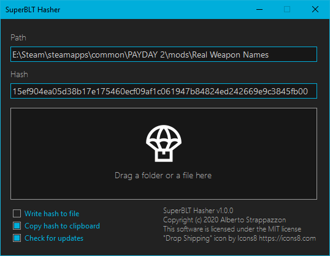

<!-- markdownlint-disable-next-line MD041 -->


## Getting Started

### GUI

- [Download the latest version](https://github.com/Strappazzon/PD2-SuperBLT-Hasher/releases/latest) of SuperBLT Hasher

- Launch **SuperBLT Hasher.exe**
- Drag and drop a folder or file inside the drag-and-drop area
- Copy the hash to clipboard

### Command Line

- [Download the latest version](https://github.com/Strappazzon/PD2-SuperBLT-Hasher/releases/latest) of SuperBLT Hasher
- Simply pass the path as an argument

`./superblthasher-cli.exe "D:\Mod Folder"`

## Screenshot

## Source Code

The complete SuperBLT Hasher source code is available [on GitHub](https://github.com/Strappazzon/PD2-SuperBLT-Hasher).
