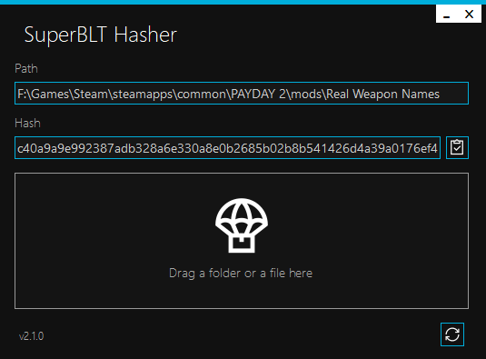

<h1 align="center">
   
  
   
  SuperBLT Hasher
   
</h1>

<h4 align="center">Generate hashes for PAYDAY 2 mods.</h4>

  <a href="#about">About</a> •
  <a href="#usage">Usage</a> •
  <a href="#screenshot">Screenshot</a> •
  <a href="#download">Download</a> •
  <a href="#source-code">Source Code</a> •
  <a href="#license">License</a>

## About

SuperBLT Hasher is a Visual Basic .Net/C# implementation of the [SuperBLT Hashing Library](https://gitlab.com/SuperBLT/HashLib). Hashing of single files and folders is supported.

## Usage

### GUI

1. Launch **SuperBLT Hasher.exe**.
2. Drag and drop a folder or file inside the dark area where it says **"Drag a folder or file here"**.
3. Copy the hash to clipboard.

### Command Line

Simply pass the file or folder path to **superblthasher-cli.exe**.

#### Example

> superblthasher-cli "D:\Path\To Mod\Folder"

## Screenshot

## Download

You can [download](https://github.com/Strappazzon/PD2-SuperBLT-Hasher/releases/latest) the latest version of SuperBLT Hasher from the Releases page.

## Source Code

The complete SuperBLT Hasher source code is available [on GitHub](https://github.com/Strappazzon/PD2-SuperBLT-Hasher).

## License

By downloading and/or using SuperBLT Hasher, you are agreeing to the license terms.

> Copyright (c) 2020 - 2021 Alberto Strappazzon
>
> Permission is hereby granted, free of charge, to any person obtaining a copy
> of this software and associated documentation files (the "Software"), to deal
> in the Software without restriction, including without limitation the rights
> to use, copy, modify, merge, publish, distribute, sublicense, and/or sell
> copies of the Software, and to permit persons to whom the Software is
> furnished to do so, subject to the following conditions:
>
> The above copyright notice and this permission notice shall be included in all
> copies or substantial portions of the Software.
>
> THE SOFTWARE IS PROVIDED "AS IS", WITHOUT WARRANTY OF ANY KIND, EXPRESS OR
> IMPLIED, INCLUDING BUT NOT LIMITED TO THE WARRANTIES OF MERCHANTABILITY,
> FITNESS FOR A PARTICULAR PURPOSE AND NONINFRINGEMENT. IN NO EVENT SHALL THE
> AUTHORS OR COPYRIGHT HOLDERS BE LIABLE FOR ANY CLAIM, DAMAGES OR OTHER
> LIABILITY, WHETHER IN AN ACTION OF CONTRACT, TORT OR OTHERWISE, ARISING FROM,
> OUT OF OR IN CONNECTION WITH THE SOFTWARE OR THE USE OR OTHER DEALINGS IN THE
> SOFTWARE.
